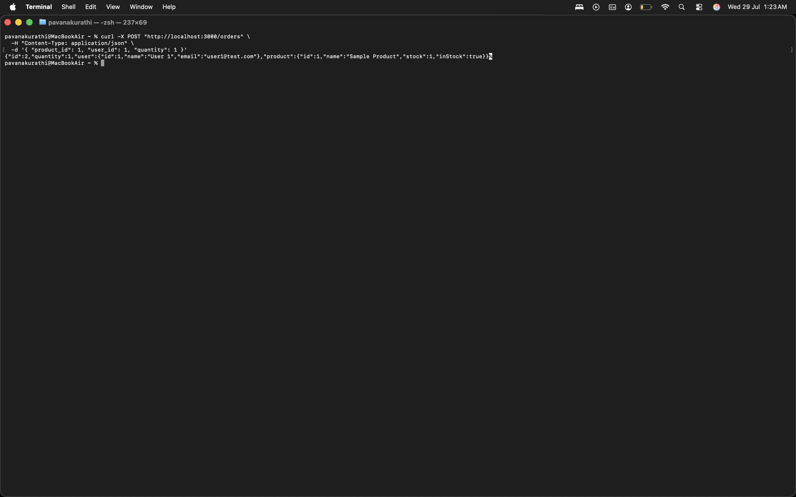
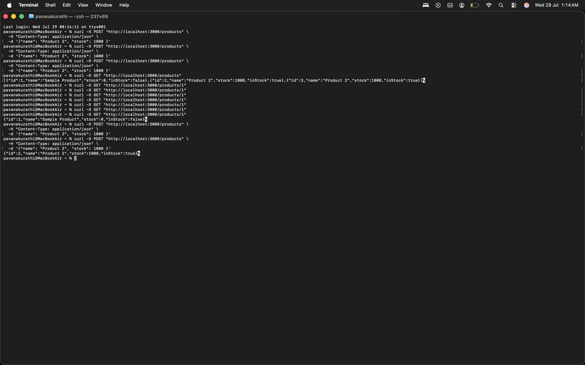
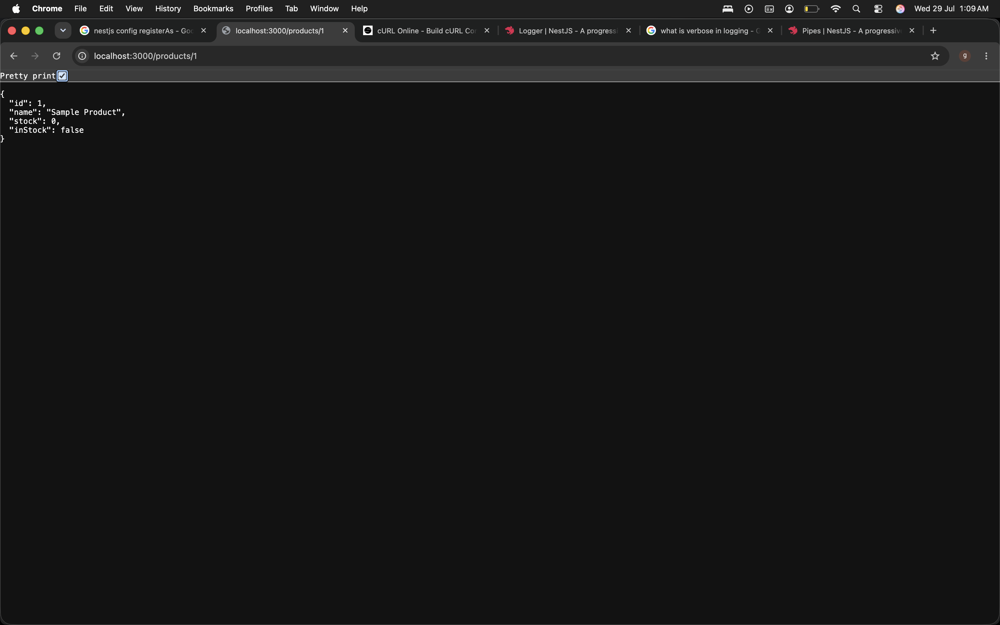
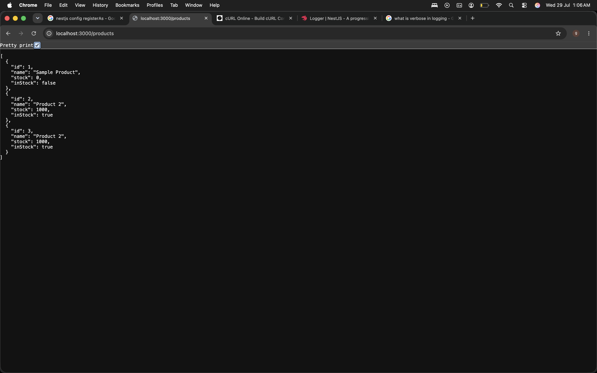
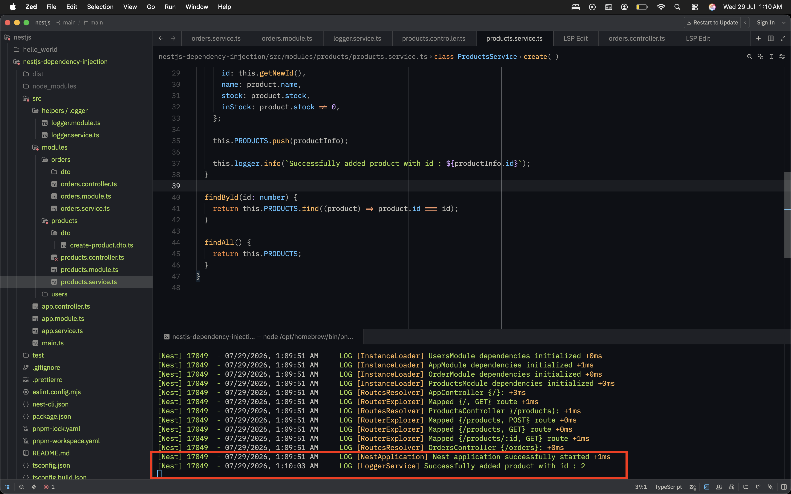

## Create product and order paths

### Why DI?
The DI helps in code reusability and making the service only see what it intended to see rather than un nessessary logic,
let's say you have a storage service which stores files of various
types, you want to switch between local mode and remote (s3 mode) based
on the cost and the state of the project. Now a simple solution would be
changing the `new method` to something like `new Local() / new S3()`
which is not a good practise to have in the class which is responible
for only triggering the event to store and not where to store. So with DI
we can instead do something like attaching named / custom flow by which 
the classes / functions responsible for triggering store the flow will
not be bothered with where to store. In simple we get rid of hardcoded
initiation of service or classes and make it easier to adapt for different
purposes
