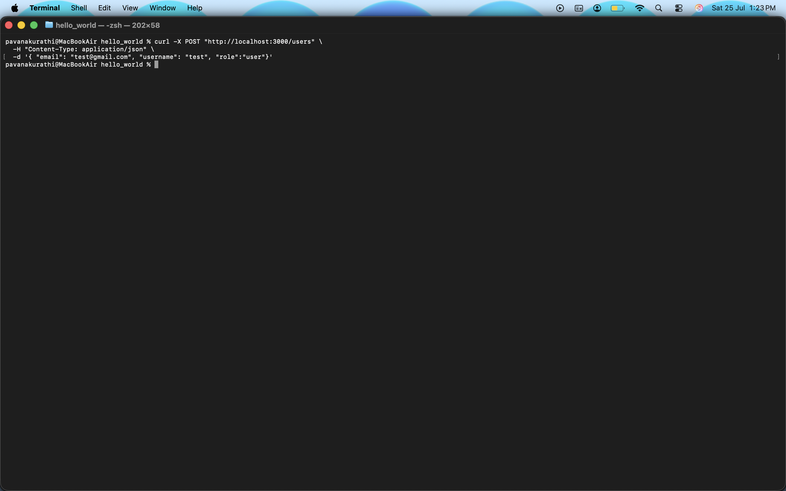
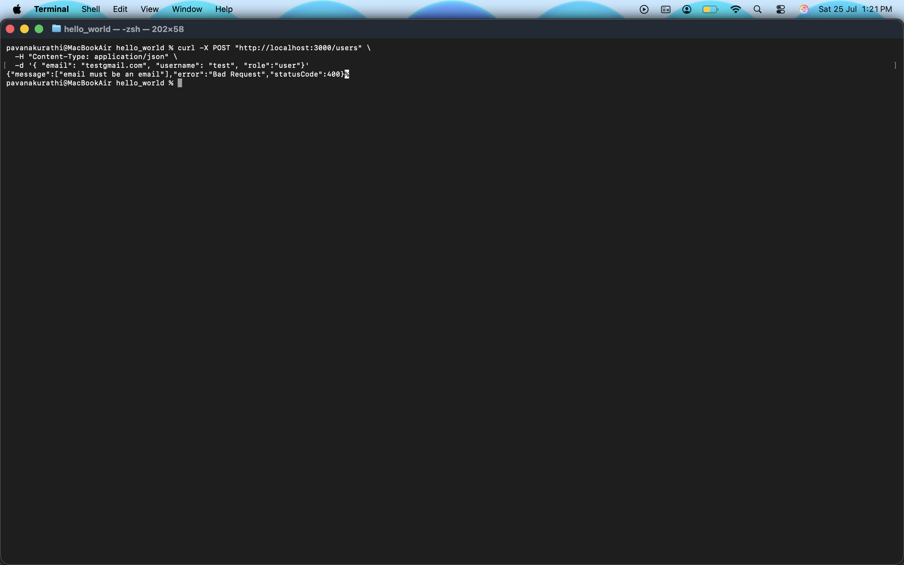
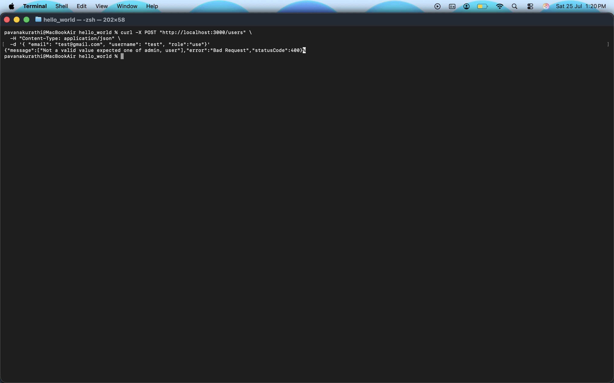
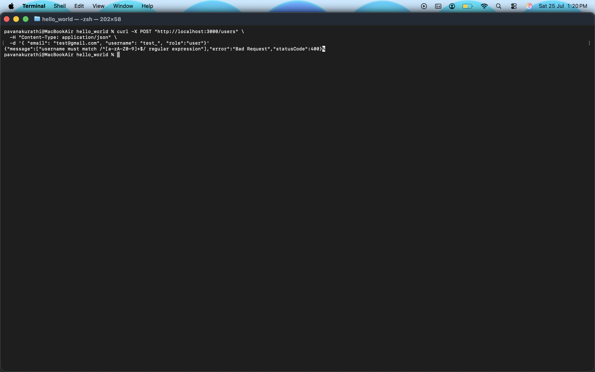
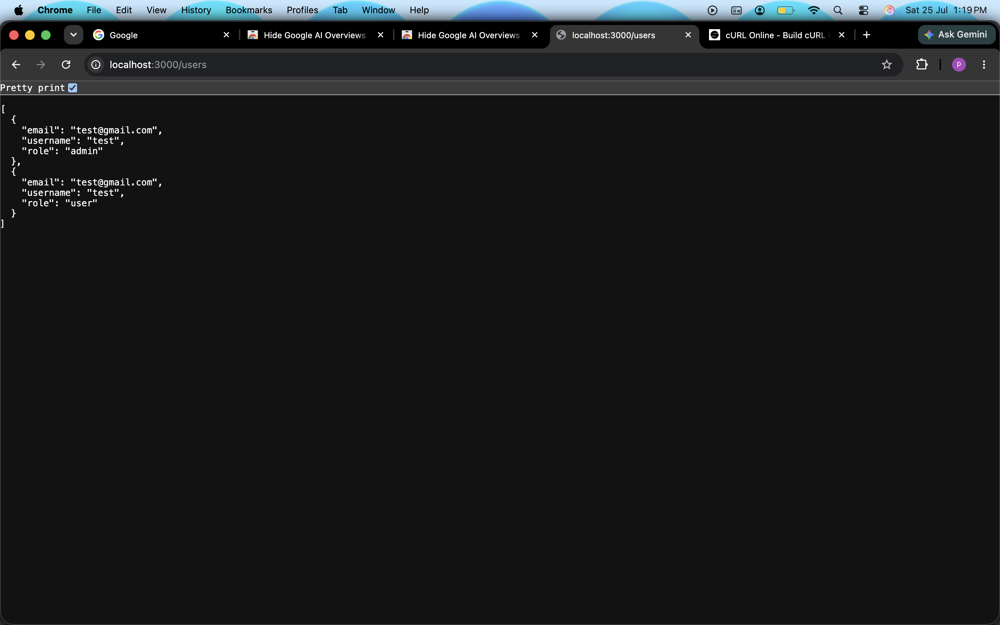
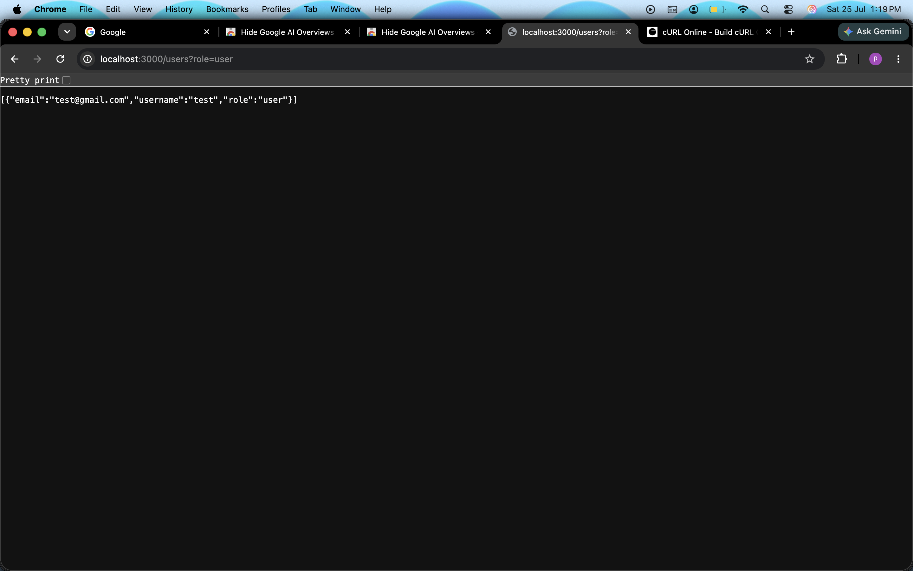

## Create User paths

### User Created successfully

### Invalid Email

### Invalid Role

### Invalid Username

## Get User paths

### Get users with no role filter

### Get users with admin role filter

### Get users with user role filter

